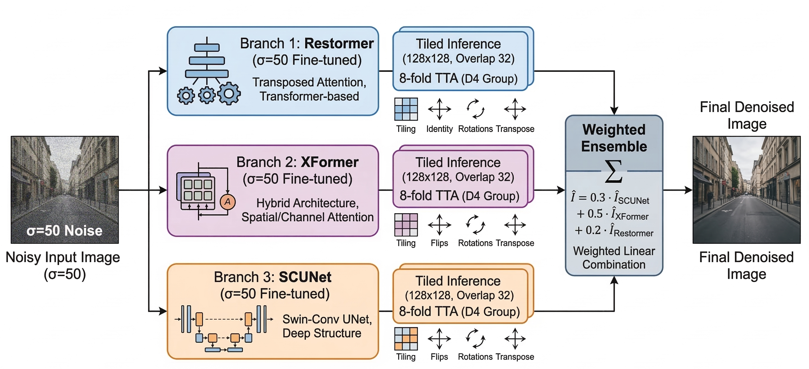

# NTIRE 2026 Image Denoising (σ=50) — Team Noice (SRX) — 6th Place

[](https://arxiv.org/abs/2606.16031)

Official solution of **Team Noice** for the [NTIRE 2026 Image Denoising Challenge (σ=50)](https://cvlai.net/ntire/2026/) @ CVPRW 2026, finishing **6th place** on the final leaderboard.

We propose **SRX**, an ensemble pipeline that fuses three independently fine-tuned restoration backbones — **Restormer**, **XFormer**, and **SCUNet** — combined with tiled inference and 8-fold geometric test-time augmentation (TTA), followed by a weighted linear ensemble.

## Method Overview

SRX is built upon an ensemble of three state-of-the-art transformer- and CNN-based restoration networks. Each model is independently fine-tuned on a combined high-quality dataset and fused via a weighted ensemble strategy at inference time. Tiled inference and 8-fold D4 TTA are applied to each branch to boost performance and handle arbitrarily large inputs efficiently.


*Figure 1: Overview of the proposed SRX pipeline. Each of the three branches independently denoises the noisy input via tiled inference + 8-fold TTA; the outputs are then fused with a weighted linear combination to produce the final denoised image.*

### Branch 1 — Restormer (σ=50 fine-tuned)

Hierarchical encoder–decoder transformer using **transposed (channel-wise) multi-head self-attention** instead of spatial attention, making it tractable for high-resolution images.

- `dim = 48`
- `num_blocks = [4, 6, 6, 8]`
- `num_refinement_blocks = 4`
- `heads = [1, 2, 4, 8]`
- FFN expansion factor: `2.66`
- BiasFree LayerNorm (required for the Gaussian denoising variant)
- Initialized from the official `gaussian_color_denoising_sigma50.pth` checkpoint

### Branch 2 — XFormer (σ=50 fine-tuned)

Hybrid X-shaped architecture combining **spatial window-based self-attention** and **channel-wise attention**, giving receptive fields complementary to Restormer.

- `dim = 48`
- `num_blocks = [2, 4, 4]`
- `spatial_num_blocks = [2, 4, 4, 6]`
- `num_refinement_blocks = 4`
- `heads = [1, 2, 4, 8]`
- Window size: `16 × 16` at each scale
- Initialized from the publicly released denoising weights, then fine-tuned

### Branch 3 — SCUNet (σ=50 fine-tuned)

Swin-Conv UNet integrating Swin Transformer blocks and convolutional residual blocks in a symmetric encoder–decoder structure.

- `config = [4, 4, 4, 4, 4, 4, 4]` (seven-stage depth)
- `dim = 64`
- Initialized from the official `scunet_color_50.pth` checkpoint, then fine-tuned

### Tiled Inference

Since inputs can be arbitrarily large, all three branches use overlapping tile-based inference:

- Tile size: `128 × 128`
- Overlap: `32` px per border (stride = `128 - 32 = 96`)
- Overlapping regions are accumulated and averaged with a pixel-wise weight map to eliminate seam artefacts

### Test-Time Augmentation (8-fold, D4 group)

Each branch averages predictions over all 8 symmetries of the dihedral group D4:

1. Identity
2. Horizontal flip
3. Vertical flip
4. Horizontal + vertical flip (180° rotation)
5. Transpose
6. Transpose + horizontal flip
7. Transpose + vertical flip
8. Transpose + horizontal + vertical flip

Each augmented view is passed through the model (with tiled inference), the inverse transform is applied to the output, and all 8 results are averaged pixel-wise.

### Weighted Ensemble

The final image is a weighted linear combination of the TTA-averaged outputs of the three branches:

```
Î = 0.3 · Î_SCUNet + 0.5 · Î_XFormer + 0.2 · Î_Restormer
```

Weights were tuned empirically on the CodaBench validation leaderboard — XFormer receives the highest weight as it showed the strongest standalone performance on the validation split.

## Training Details

**Data.** Combined clean-image corpus, with σ=50 Gaussian noise synthesized on-the-fly (no external noisy images used):
- [LSDIR](https://github.com/ofsoundof/LSDIR) — 2,000 sampled images
- [DIV2K](https://data.vision.ee.ethz.ch/cvl/DIV2K/) — 800 training images

**Augmentation.** Random 64×64 crop (bilinear upscale if the source is smaller) → on-the-fly AWGN (σ=50) → random horizontal/vertical flips → random 90° rotations.

**Loss.** ℓ1 (mean absolute error) between the restored patch and the clean ground truth.

**Optimizer.** AdamW, lr = `1e-4`, β₁ = 0.9, β₂ = 0.999.

**Schedule.** Batch size `4`, patch size `64×64`, `40` epochs per model, mixed precision (AMP + `GradScaler`).

**Partial freezing (Restormer only).** The three encoder stages (`encoder_level1/2/3`) are frozen during fine-tuning; only the bottleneck, decoder, and refinement blocks are updated. This avoids overfitting the already well-trained low-level features given the relatively small fine-tuning set.

Each of the three backbones is fine-tuned **independently** under this same protocol.

## Setup

```bash
pip install torch torchvision torchaudio --index-url https://download.pytorch.org/whl/cu124
pip install -r requirements.txt
```

## Download Weights

Download the fine-tuned checkpoints and place all three files in `model_zoo/`.

> **Note:** double check the individual links below before sharing this repo — all three currently point to the same file ID. Grab the correct file for each checkpoint name from the folder link, or replace these with the correct per-file share links.

Folder (all checkpoints): https://drive.google.com/drive/folders/1jxCEg71H4Clrm-ERoDg9O6gP9fjbxNPB?usp=sharing

| File | Branch | Link |
|---|---|---|
| `team08_RestormerFT.pth` | Restormer | [Download](https://drive.google.com/file/d/1UZlX8Nd6UKDhPFU4sNPVs3Q3CjkhXcmF/view?usp=sharing) |
| `team08_XformerFT.pth` | XFormer | [Download](https://drive.google.com/file/d/1UZlX8Nd6UKDhPFU4sNPVs3Q3CjkhXcmF/view?usp=sharing) |
| `team08_ScunetFT.pth` | SCUNet | [Download](https://drive.google.com/file/d/1UZlX8Nd6UKDhPFU4sNPVs3Q3CjkhXcmF/view?usp=sharing) |

## Run Inference

```bash
python test_demo.py --data_dir ./data --save_dir ./results --model_id 8
```

This runs the full SRX pipeline: tiled inference + 8-fold TTA for each of the three branches, followed by the weighted ensemble, on every image in `--data_dir`, saving results to `--save_dir`.

## Results

- Development phase entry ID: `599941`
- Validation phase entry ID: `625178`
- Final ranking: **6th place** (NTIRE 2026 Image Denoising, σ=50 track)
- Quantitative PSNR/SSIM results are available on the official NTIRE 2026 CodaBench leaderboard.

## Citation

If you find this work useful, please consider citing the official challenge report:

```bibtex
@article{ntire2026dn50,
  title   = {The Third Challenge on Image Denoising at NTIRE 2026: Methods and Results},
  journal = {arXiv preprint arXiv:2606.16031},
  year    = {2026}
}
```

## Acknowledgements

Our SRX pipeline builds on the official implementations of [Restormer](https://github.com/swz30/Restormer), [XFormer](https://github.com/gladzhang/Xformer), and [SCUNet](https://github.com/cszn/SCUNet). We thank the NTIRE 2026 organizers for hosting a well-structured and fair evaluation environment on CodaBench.